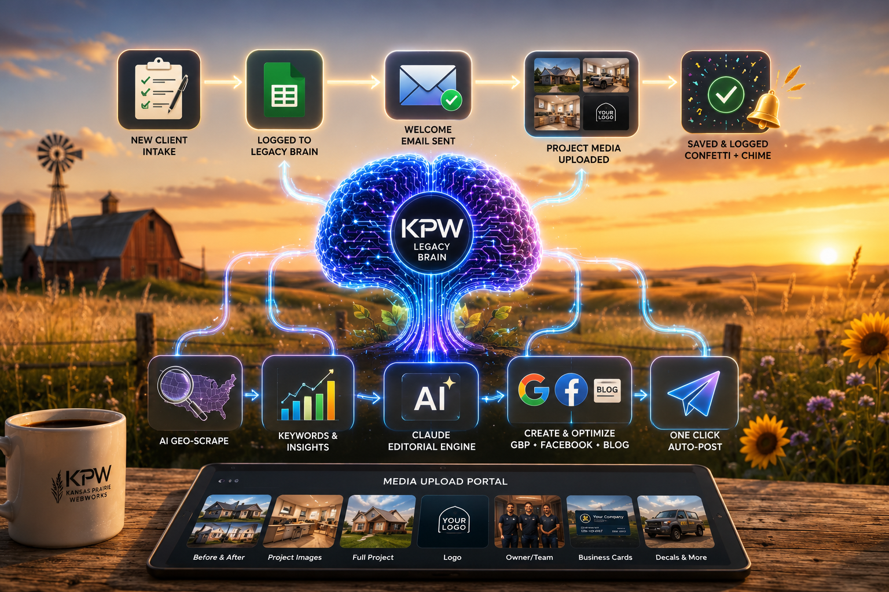

# INTAKE_FROM_BUILD.md
# KPW Tier 4 — Agency Brain Bridge
# Kansas Prairie Webworks — Internal use only
# 
# DROP THIS FILE into any new client build folder.
# Then tell Claude Code: "Read INTAKE_FROM_BUILD.md and execute"
# Claude Code does the rest — no manual copy-paste needed.
#
# Last updated: June 25, 2026 — v33

---

## RECENT SITE UPDATES — kpw-build marketing site (2026-07-17)

Two autonomous content passes landed on the live kpw-build site since this template was last updated — not part of the Tier 4 build process below, but relevant context if you're pulling reference copy from the live site.

- **Commit `acdb807`**: portal screenshots wired into `service-monthly-posting.html`, human-in-the-loop approval language added sitewide, geographic SEO anchoring strengthened (Central Kansas town names in body copy), `service-web-app.html` clarified as not mobile app development.
- **Commit `0fe8f4a`**: `pricing.html`'s Top Tier toggle card split into two standalone cards (Active Content $800/$350mo, Maintenance $1,200/$150mo), service-selection dropdowns expanded to a full smorgasbord list on `service-monthly-posting.html` and `contact.html`, Stripe trust language added, 4 new FAQ entries added to `faq.html`'s JSON-LD schema.

See `KPW_HANDOFF_FINAL.md` for full detail. `ai-services.html` and `use-cases.html` were not touched.

---

## YOUR MISSION

You are building a complete Tier 4 local business website
for a KPW client. All client data lives in the KPW Agency Brain
Google Sheet. Pull everything from there first, then build.

Do NOT ask Kaleb for information that exists in the Sheet.
Do NOT leave any field blank if the data exists somewhere.
Do NOT start building until Steps 1-4 are complete.
CLIENT_BRIEF_TEMPLATE.md is a fallback only — Agency Brain
is always the primary source of truth.

---

## TECHNICAL FIELDS — FILL BEFORE RUNNING
## Kaleb fills these in after client signs and infrastructure is set up.
## Everything else comes from Agency Brain automatically.

```
GitHub Repo URL:    [paste full GitHub repo URL here]
Formspree Form ID:  [paste Formspree form ID here]
```

Example:
```
GitHub Repo URL:    https://github.com/BbotAI/client-name.git
Formspree Form ID:  xabcd1234
```

---

## STEP 1 — IDENTIFY THE CLIENT

Look at the name of the current folder you are working in.
Convert it to a Client ID format:
- Uppercase
- Spaces and hyphens become underscores
- Example: "mikes-services-llc" → "MIKES_SERVICES_LLC"
- Example: "jennifers-cleaning" → "JENNIFERS_CLEANING"

This is the CLIENT_ID you will use to query the Sheet.

---

## STEP 2 — PULL CLIENT DATA FROM AGENCY BRAIN

Fetch client data from this Google Sheet via the Apps Script Web App:

```
GET https://script.google.com/macros/s/AKfycbxnHiCoiuJSBcDp5yIdE-oBSh57wS4hXqUKGrvk7bxe-8UpD7cNfejpTeJIjxwF4XIz/exec?action=getClient&clientId=CLIENT_ID
```

Replace CLIENT_ID with the ID from Step 1.

The response contains all fields from the Clients sheet:
clientName, domain, blogUrl, blogId, businessType,
featuredService, serviceAreas, phone, email, cta, tagline,
customerWords, whatSetsApart, busiestMonth, slowestMonth,
recentJobPride, topQ1, topQ2, topQ3, jobsToAvoid,
competitorNotes, bestReview, footerImageUrl, logoUrl,
imageLibraryUrls, teamNotes, ownerStory, hours,
emergencyAfterHours, primaryColor, accentColor

If Agency Brain GET fails → fall back to CLIENT_BRIEF_TEMPLATE.md.
Log the fallback in PROGRESS.md and continue.

---

## STEP 3 — PULL SERVICES FROM AGENCY BRAIN

```
GET https://script.google.com/macros/s/AKfycbxnHiCoiuJSBcDp5yIdE-oBSh57wS4hXqUKGrvk7bxe-8UpD7cNfejpTeJIjxwF4XIz/exec?action=getServices&clientId=CLIENT_ID
```

Returns array of services with:
serviceName, primaryService, serviceDescription,
targetLocations, serviceUrl, serviceWeight

Use serviceName to build service page filenames:
"Septic Installation" → septic-installation.html
"Land Clearing" → land-clearing.html
"Excavation and Trenching" → excavation-and-trenching.html
"Demolition" → demolition.html

---

## STEP 4 — PULL TOP CONTENT IDEAS

```
GET https://script.google.com/macros/s/AKfycbxnHiCoiuJSBcDp5yIdE-oBSh57wS4hXqUKGrvk7bxe-8UpD7cNfejpTeJIjxwF4XIz/exec?action=getTopIdeas&clientId=CLIENT_ID&limit=5
```

Returns top 5 scored Content_Ideas per service.
Use these as:
- Service page H2 sections
- FAQ questions on each service page
- Blog post topics to note in PROGRESS.md
- Internal linking targets

---

## STEP 5 — PULL APPROVED IMAGES FROM CLOUDINARY

Image Library URLs are in the client data from Step 2.
Parse the JSON array. Each entry has:
{ url, description, category, type, service }

Assign images by service and category:
1. category:logo → logo.png (download to images/)
2. service:septic-installation + category:single → septic hero
3. service:land-clearing + category:single → clearing hero
4. service:demolition + category:single → demo hero
5. service:excavation-and-trenching → excavation hero
6. First project image → hero-home.jpg
7. Additional images → service heroes, featured images

Also check the images/ folder in this client folder.
Any images dropped in manually take priority over Cloudinary URLs.
If no images available → use gradient heroes, note in PROGRESS.md.

---

## STEP 6 — MAP AGENCY BRAIN DATA TO BUILD

Use this mapping to populate every field in the build:

```
Agency Brain Field          → Build Usage
─────────────────────────────────────────────────────
clientName                  → Business name throughout
phone                       → All tel: links + display
email                       → Contact form + footer
domain                      → All URLs + CNAME file
blogUrl                     → Blog links (use
                              blog.[domain] not blogspot)
tagline                     → Hero lead text seed
serviceAreas                → County pages + area cards
hours                       → Contact page + schema
emergencyAfterHours         → Inject 24/7 if applicable
customerWords               → FAQ questions (real voice)
whatSetsApart               → Featured section + about
bestReview                  → Trust signal on homepage
recentJobPride              → Featured project section
topQ1/Q2/Q3                → Homepage FAQ section
jobsToAvoid                 → Do NOT include these
competitorNotes             → Positioning (internal only)
teamNotes                   → About page team section
ownerStory                  → About page owner column
logoUrl                     → Logo (download to images/)
footerImageUrl              → Footer image
imageLibraryUrls            → Service hero images
primaryColor                → CSS --color-primary
accentColor                 → CSS --color-accent
GitHub Repo URL             → git remote add origin
Formspree Form ID           → contact form action URL
```

---

## STEP 7 — BUILD THE WEBSITE

Read BUILD_COMMAND_TEMPLATE.md and execute the full build.
Use Agency Brain data as the single source of truth.
Use GitHub Repo URL and Formspree Form ID from the
Technical Fields section at the top of this file.

Build must include:
- index.html
- One .html per service (from Services data)
- Six county geo pages (from serviceAreas data)
- contact.html, about.html, blog.html
- service-monthly-posting.html (standard on every build)
- ai-services.html (standard on every build — see AI SERVICES PAGE section)
- sitemap.xml, robots.txt, styles.css, main.js
- Schema + Open Graph on every page (see SCHEMA REQUIREMENTS section)
- robots.txt with AI crawler rules (see ROBOTS.TXT section)
- Internal links between all pages
- Client photos placed by service match
- Formspree form connected with correct ID
- All blog links pointing to blog.[domain]
  never to blogspot.com
- main.js loaded with cache bust: src="main.js?v=1"
  Increment ?v= number on every JS change deployment

---

---

## CANONICAL PRICING STRUCTURE (v32 — locked)

Use these exact prices in every build. Do not deviate.

```
TIER 1 — STARTER
  Setup:    $450 one-time
  Monthly:  $25/month hosting
  Pages:    4 — Home, About, Contact, Blog
  Includes: SSL, domain mgmt, hosting handled by KPW,
            3 starter blog posts (one per service, up to 3)

MONTHLY POSTING — STANDALONE ADD-ONS
  Facebook Posting:           $100/month
    → 8 keyword-driven posts/month + 2 AI-SEO blog posts
  Google Business Posting:    $100/month
    → 8 posts/month + 2 AI-SEO blog posts
  Facebook + Google Combined: $150/month
    → 8 posts/month to both platforms + 2 AI-SEO blog posts

BLOG WRITING ADD-ON
  2 Posts/month:  $50/month
  4 Posts/month:  $100/month
  (AI-SEO optimized, published to client website)

TOP TIER — MAINTENANCE PLAN (default/toggle state)
  Setup:    $1,200 one-time
  Monthly:  $150/month
  Includes: Full multi-page site (Home, About, Services,
            Service Area, Contact), GBP setup + verification,
            Facebook Business Page, directory listings (Yelp,
            Bing, Apple Maps), monthly site maintenance,
            one client update/month, SSL + hosting + domain mgmt

TOP TIER — ACTIVE CONTENT PLAN (toggle state)
  Setup:    $800 one-time
  Monthly:  $350/month (billed 30 days after start)
  Includes: Everything in $150/mo plan PLUS full AI pipeline:
            4 Google Business posts/week, 4-8 Facebook posts/week,
            2-4 blog posts/month, geographic SEO research,
            client image portal, KPW Legacy Brain,
            content calendar monthly, client review portal
  Note:     $350/month continues until written cancellation per terms
```

Pricing toggle on Top Tier card:
- Default display: $1,200 setup / $150/month (Maintenance Plan)
- Toggle to: $800 setup / $350/month (Active Content Plan)
- JS handles innerHTML swap via MAINTENANCE_BULLETS / ACTIVE_BULLETS arrays
- Bottom note also toggles per plan
- Class targets: .pricing-toggle__btn[data-tier], .tier4-note

---

## MONTHLY POSTING PAGE + INTAKE FORM SYSTEM (v32)

service-monthly-posting.html structure:
- 3 pricing cards: FB $100 / GB $100 / Combined $150 (featured)
- Blog Writing Add-On card with 2-post / 4-post toggle
- Intake form at anchor: id="blog-intake"

Card CTA data-service attributes:
```
Facebook Posting card:    data-service="fb-100"
Google Business card:     data-service="gb-100"
Combined card:            data-service="combined-150"
Blog card (2-post):       data-service="blog-2-50"
Blog card (4-post):       data-service="blog-4-100"
```

All CTAs: href="#blog-intake" — scroll to intake form

Intake form:
- Formspree endpoint: https://formspree.io/f/[FORMSPREE_ID]
- _subject: "New Posting Services Inquiry — [Business Name]"
- Service display: <div id="kpw-service-text"> (auto-fills from localStorage)
- Hidden field: <input type="hidden" name="selected_service" id="kpw-service-hidden">
- Manual dropdown: <select id="kpw-service-manual"> with all 5 service options
- localStorage key: kpw_service
- JS: initServiceTracking() IIFE in main.js — syncs form on load + hashchange

Blog toggle JS: initBlogToggle() IIFE in main.js
- Swaps price, label, CTA text, data-service attr, localStorage on btn click
- Buttons: [data-blog-tier="blog-2"] / [data-blog-tier="blog-4"]
- Classes: .blog-card-price, .blog-monthly-label, .blog-cta

---

## AI SERVICES PAGE (v32 — standard on every build)

ai-services.html is required in every client build.
Customize the geographic references and service descriptions per client.

Page sections:
1. Hero — "Your Business. Posting Every Week. Without You Lifting a Finger."
2. Pipeline — 6-step cards (dark bg, orange numbered circles, grid-2 layout)
3. What's Included — 9-feature grid (dark bg with CSS grid overlay)
4. Pricing Callout — featured card linking to pricing.html + contact.html
5. Who It's For — 3-audience cards (Trades, Service, Retail)
6. Local Advantage — dark section, geography-specific copy
7. FAQ — 5 questions using existing faq-item accordion (main.js handles it)
8. Closing CTA — phone + email action buttons + contact form link

Schema on ai-services.html (all 4 required):
- Service (with areaServed Cities + County)
- FAQPage (5 Q&As matching on-page accordion)
- BreadcrumbList (Home → AI Services)
- WebPage

Nav: "AI Services" link added after "Blog" in desktop nav, mobile nav.
Footer Services column: add AI Services link.

---

## VIDEO INTRO SYSTEM (v33 — ai-services.html)

If client has an intro video (produced via Opus AI or similar):
- Filename: ai-services-intro.mp4
- Place in root of build folder (same level as index.html)
- Embed as first section inside `<main>` on ai-services.html, before the hero

Embed template:
```html
<!-- ═══ VIDEO INTRO ═══ -->
<section style="background:var(--dark);line-height:0;overflow:hidden;position:relative;" aria-label="AI Services introduction video">
  <video id="kpw-intro-video" autoplay muted playsinline preload="auto"
    poster="images/[poster-filename].jpg"
    style="width:100%;display:block;max-height:90vh;object-fit:cover;"
    aria-label="[Business Name] AI-powered content pipeline introduction">
    <source src="ai-services-intro.mp4" type="video/mp4">
  </video>
  <button id="kpw-unmute-btn"
    onclick="var v=document.getElementById('kpw-intro-video');v.muted=false;v.currentTime=0;v.play();this.style.display='none';"
    aria-label="Unmute video"
    style="position:absolute;bottom:28px;right:28px;background:rgba(0,0,0,0.65);border:2px solid rgba(255,255,255,0.7);color:#fff;border-radius:50%;width:56px;height:56px;font-size:22px;cursor:pointer;display:flex;align-items:center;justify-content:center;backdrop-filter:blur(6px);">&#x1F507;</button>
  <button id="kpw-replay-btn"
    onclick="var v=document.getElementById('kpw-intro-video');v.currentTime=0;v.play();this.style.display='none';"
    aria-label="Replay video"
    style="position:absolute;bottom:28px;right:28px;background:rgba(0,0,0,0.65);border:2px solid rgba(255,255,255,0.7);color:#fff;border-radius:50%;width:56px;height:56px;font-size:22px;cursor:pointer;display:none;align-items:center;justify-content:center;backdrop-filter:blur(6px);">&#x21BA;</button>
  <script>(function(){var v=document.getElementById('kpw-intro-video');v.addEventListener('ended',function(){document.getElementById('kpw-replay-btn').style.display='flex';});})();</script>
</section>
```

Behavior:
- Autoplay muted (browser requirement — audio blocked on autoplay)
- 🔇 unmute button: bottom-right, frosted glass, disappears on click
- ↺ replay button: appears in same spot when video ends, disappears on click
- poster= image: first frame screenshot of video, saves as JPG ~50KB in images/
- No video? Skip section entirely — do not use placeholder

Video specs (Opus AI):
- Format: 16:9, MP4
- Style: 3D Scientific Visualization
- Captions: ON
- Engine: Seedance 1.5 Pro
- Target: 15–30 seconds
- Keep "Legacy Brain" as brand term in VO
- Do not expose internal methodology in visuals

---

## HOMEPAGE STANDARDS (v33)

### H1 — Geo Keyword Required
Homepage H1 must include city/region keyword. Do not use benefit-only H1.

```html
<!-- Correct -->
<h1>Web Design &amp; Online Marketing for <span class="text-pop">[City], Kansas</span> Small Businesses</h1>

<!-- Wrong — no geo signal -->
<h1>Your <span class="text-pop">Complete Online Presence</span></h1>
```

### Favicon — Required on Every Page
Add to `<head>` on all HTML pages, before `<link rel="canonical">`:
```html
<link rel="icon" type="image/png" href="images/kpw-logo-badge.png" sizes="32x32">
<link rel="apple-touch-icon" href="images/kpw-logo-badge.png">
```
Add sitewide via PowerShell — do not add manually per page.
Use client logo badge file. Shows in browser tabs and phone home screens.

### Reviews / Testimonials Section — Required on Homepage
Add between Portfolio section and FAQ section on index.html.
Use real client names and real quotes from Facebook recommendations or Google reviews.
Never ship a homepage without at least 2 testimonials.

Section template (dark background, 3-card grid):
```html
<section class="section" aria-labelledby="reviews-heading" style="background:var(--dark);">
  <div class="container">
    <div class="section__header animate-on-scroll">
      <h2 id="reviews-heading" style="color:var(--white);">What [City] Business Owners Are Saying</h2>
      <p style="color:var(--text-muted);">Real clients. Real results. Verified on [platform].</p>
    </div>
    <div style="display:grid;grid-template-columns:repeat(auto-fit,minmax(280px,1fr));gap:1.5rem;">
      <!-- repeat card block per review -->
      <div class="card-glass animate-on-scroll animate-delay-1" style="padding:1.75rem;">
        <div style="color:var(--primary);font-size:1.1rem;margin-bottom:0.75rem;">&#9733;&#9733;&#9733;&#9733;&#9733;</div>
        <p style="color:var(--white);font-style:italic;margin-bottom:1rem;">&ldquo;[Quote]&rdquo;</p>
        <div style="color:var(--text-muted);font-size:0.875rem;font-weight:600;">[Business Name] <span style="color:var(--primary);">&#10003; Recommends</span></div>
        <div style="color:var(--text-muted);font-size:0.8rem;">[City, KS] &mdash; via [Google/Facebook]</div>
      </div>
    </div>
    <div style="text-align:center;margin-top:2rem;display:flex;flex-wrap:wrap;gap:1rem;justify-content:center;" class="animate-on-scroll">
      <a href="[google-review-link]" target="_blank" rel="noopener" class="btn btn--primary"><i class="fab fa-google" aria-hidden="true"></i>&nbsp; Leave a Google Review</a>
      <a href="[facebook-reviews-link]" target="_blank" rel="noopener" class="btn btn--outline">See All Facebook Reviews &rarr;</a>
    </div>
  </div>
</section>
```

### Portfolio Cards — Name Real Clients
If client gives permission, name portfolio cards with real business name + live link.
Replace generic "Central Kansas client" with actual name.
Use `<a href="[live URL]">` as the card wrapper when a live site link exists.
Use `<a href="[Facebook page URL]">` for Facebook portfolio cards.
One named client with a link is stronger than ten anonymous screenshots.

---

## GOOGLE BUSINESS PROFILE STANDARD (v33)

### Setup — Service Area Business (SAB)
KPW and most clients travel to customers. Set up GBP as SAB:
1. business.google.com → Add business
2. Primary category: matches client's main service
3. "Do customers visit your location?" → No
4. "Do you serve customers outside this location?" → Yes
5. Add service areas: match serviceAreas field from Agency Brain
6. Verify with home/office address — address stays PRIVATE, never shown publicly
7. Do NOT put the address on the website — city-level only in footer and schema

### GBP Integration on Website
Once GBP is verified, add to the build:

**contact.html — contact info block:**
```html
<div class="contact-info-item">
  <i class="fab fa-google" aria-hidden="true"></i>
  <div>
    <strong style="display:block;color:var(--text-light);font-family:'Poppins',sans-serif;">Google</strong>
    <a href="[GBP share link]" target="_blank" rel="noopener">Find us on Google</a>
  </div>
</div>
```

**contact.html — GBP listing section (after form, before CTA banner):**
```html
<section class="section" style="background:var(--section-alt);" aria-labelledby="google-listing-heading">
  <div class="container">
    <div class="section__header animate-on-scroll">
      <h2 id="google-listing-heading" style="color:var(--dark);">Find Us on <span class="text-pop">Google</span></h2>
      <p style="color:var(--text);">Search "[Business Name]" or use our listing below.</p>
    </div>
    <div style="display:flex;flex-wrap:wrap;gap:2.5rem;align-items:center;justify-content:center;">
      
      <div style="max-width:360px;">
        <p style="color:var(--text);margin-bottom:1.5rem;">We&rsquo;re verified on Google. A quick Google review helps other local businesses find us.</p>
        <a href="[google-review-link]" target="_blank" rel="noopener" class="btn btn--primary btn--large" style="margin-bottom:1rem;display:inline-flex;">
          <i class="fab fa-google" aria-hidden="true"></i>&nbsp; Leave Us a Google Review
        </a><br>
        <a href="[GBP share link]" target="_blank" rel="noopener" class="btn btn--outline" style="margin-top:0.75rem;display:inline-flex;">
          View Our Google Listing &rarr;
        </a>
      </div>
    </div>
  </div>
</section>
```

**LocalBusiness schema sameAs — add GBP share link:**
```json
"sameAs": [
  "https://www.facebook.com/[page]",
  "https://blog.[domain]",
  "[GBP share link]"
]
```

**GBP listing card image:** Save screenshot of the GBP listing card as `images/gb_listing_card.png`.
Compress to WebP before shipping — target under 150KB.

**Google review link format:** `https://g.page/r/[CID]/review`
**GBP share link format:** `https://share.google/[token]`

### GBP Posting
Once GBP is live, add to Make.com weekly posting workflow.
GBP posts feed from Publish_Queue via Make.com webhook — same as Facebook.

---

## SCHEMA REQUIREMENTS (v32 — full pass required)

Every page must have the correct schema type. No page ships without it.

```
Page                        Schema Types Required
────────────────────────────────────────────────────────────
index.html                  LocalBusiness + WebSite + WebPage
about.html                  AboutPage + Person (founder) + BreadcrumbList
services.html               CollectionPage + BreadcrumbList
service-[name].html         Service + BreadcrumbList
  Service block must include:
  - name, description, serviceType, url
  - provider (LocalBusiness with address)
  - areaServed (City objects for each service town)
  - offers (Offer with price + priceCurrency)
service-monthly-posting.html Service with 3 Offers array + BreadcrumbList
pricing.html                WebPage + PriceSpecification + BreadcrumbList
portfolio.html              CollectionPage + BreadcrumbList
service-areas.html          LocalBusiness + WebPage + BreadcrumbList
faq.html                    FAQPage + WebPage + BreadcrumbList
contact.html                ContactPage + mainEntity LocalBusiness + BreadcrumbList
blog.html                   Blog + BreadcrumbList (+ BlogPosting per card)
ai-services.html            Service + FAQPage + BreadcrumbList + WebPage
terms/privacy/disclaimer    WebPage + BreadcrumbList
```

areaServed standard block (use on all Service schemas):
```json
"areaServed": [
  {"@type": "City", "name": "Salina"},
  {"@type": "County", "name": "Saline County"},
  {"@type": "City", "name": "McPherson"},
  {"@type": "City", "name": "Abilene"},
  {"@type": "City", "name": "Ellsworth"},
  {"@type": "City", "name": "Concordia"},
  {"@type": "City", "name": "Junction City"},
  {"@type": "City", "name": "Manhattan"},
  {"@type": "City", "name": "Bennington"}
]
```
Replace cities with client's actual service area from Agency Brain serviceAreas field.

---

## ROBOTS.TXT STANDARD (v32)

Every build ships with robots.txt. Copy this template exactly.
Update Sitemap URL to match client domain.

```
User-agent: *
Allow: /

Disallow: /INTAKE_FROM_BUILD.md
Disallow: /KPW_PRICING_UPDATE_PROMPT.md
Disallow: /TEMPLATE_GUIDE.md

User-agent: GPTBot
Allow: /

User-agent: ChatGPT-User
Allow: /

User-agent: Google-Extended
Allow: /

User-agent: ClaudeBot
Allow: /

User-agent: anthropic-ai
Allow: /

User-agent: PerplexityBot
Allow: /

User-agent: Bytespider
Allow: /

User-agent: cohere-ai
Allow: /

User-agent: Diffbot
Allow: /

User-agent: FacebookBot
Allow: /

User-agent: Applebot
Allow: /

User-agent: Applebot-Extended
Allow: /

Sitemap: https://[clientdomain]/sitemap.xml
```

---

## STEP 8 — BLOGGER SETUP

Tell Kaleb:
"Manual step needed — create Blogger account:
1. Go to blogger.com
2. Sign in with client Google account
3. New Blog → title: [clientName] Blog
4. URL: [clientslug].blogspot.com
5. Settings → copy Blog ID
6. Come back and run:
   Store blogger for [clientName]:
   Blog ID: [paste here]
   Blog URL: [paste here]"

When Kaleb returns with Blog ID and URL, POST:
```
POST https://script.google.com/macros/s/AKfycbxnHiCoiuJSBcDp5yIdE-oBSh57wS4hXqUKGrvk7bxe-8UpD7cNfejpTeJIjxwF4XIz/exec
{
  "action": "updateClientBlogger",
  "clientId": "[CLIENT_ID]",
  "blogId": "[BLOG_ID]",
  "blogUrl": "[BLOG_URL]"
}
```

---

## STEP 8B — BLOG AGENT SETUP

Update BLOG_AGENT.md with:
- Client name
- Client domain
- Blog subdomain: blog.[clientdomain].com
- Service page filenames
- Actual blog card count from blog.html

Note top 3 blog topics from Content_Ideas in PROGRESS.md.

---

## STEP 9 — LOCAL PRESENCE

Read LOCAL_PRESENCE_COMMAND.md and execute.
Generates five marketing docs in marketing/ folder:
- Source of truth
- Competitor research
- GBP setup doc
- Facebook setup doc
- Execution plan

---

## STEP 10 — GITHUB PUSH

Use the GitHub Repo URL from Technical Fields above.

```
git init
git remote add origin [GitHub Repo URL from top of file]
git add .
git commit -m "Initial Tier 4 build — [clientName]"
git branch -M main
git push -u origin main
```

Enable GitHub Pages:
Settings → Pages → main branch → Save
Report live GitHub Pages URL to Kaleb.

---

## STEP 10B — VISUAL QA

Before reporting done, verify the live site actually renders — a green Pages
checkmark does not mean the pages work. Copy the `run-kpw-build` skill's driver
(`.claude/skills/run-kpw-build/` in the kpw-build repo) into this client's own
`.claude/skills/run-[client-slug]/`, then run it against the live GitHub Pages
URL from the step above:

```
node driver.mjs shot <live-url> out.png
node driver.mjs shot <live-url> out-mobile.png --mobile
```

Confirm both screenshots render correctly and `Console errors: none`. If the
client site has a click/tap-driven component (lightbox, accordion, toggle),
write a small interaction-test script using the driver's helpers — see
`run-kpw-build`'s `examples/lightbox-check.mjs` for the pattern. Note the result
in STEP 11's final report.

---

## STEP 11 — FINAL REPORT

```
CLIENT: [clientName]
─────────────────────────────────────────
✓ Data pulled from Agency Brain
✓ [X] services found and built
✓ [X] content ideas noted
✓ [X] client photos placed (service-matched)
✓ Website built — [X] pages
✓ ai-services.html included + nav updated
✓ service-monthly-posting.html + intake form wired
✓ Video intro embedded on ai-services.html (if client has video)
✓ Favicon added to all pages
✓ Homepage H1 includes geo keyword
✓ Testimonials section on homepage — real names, real quotes
✓ Portfolio cards named with real client + links where permitted
✓ GBP listing card on contact.html (if GBP verified)
✓ Google review link wired on homepage + contact.html
✓ GBP share link in schema sameAs
✓ Visual QA run against live URL — desktop + mobile screenshots, zero console errors
✓ Schema pass complete — all page types covered
✓ robots.txt created with AI crawler rules
✓ Sitemap.xml includes all pages
✓ main.js loaded with ?v=1 cache bust
✓ Pushed to GitHub
✓ Live at: [GitHub Pages URL]

BLANK FIELDS (fill in Agency Brain):
- [list any missing fields]

IMAGES NEEDED (replace gradient placeholders):
- [list any missing images]

NEXT ACTIONS FOR KALEB:
1. Add custom domain in GitHub Pages
2. Verify DNS in Cloudflare (A records + www)
3. Enforce HTTPS in GitHub Pages
4. Purge Cloudflare cache after any content update
5. Add to Google Search Console → verify → sitemap
6. Validate schema: search.google.com/test/rich-results
7. Set up blog.[clientdomain].com in Blogger
8. Add blog CNAMEs to Cloudflare (DNS only)
9. Add blog to Google Search Console
10. Agency Brain sidebar:
    Services tab → Research Selected Service
    (repeat for each service)
11. Generate content → review Publish_Queue
12. Connect Make.com when ready to auto-post
```

---

## COMPLETE CLIENT ONBOARDING WORKFLOW

```
PHASE 1 — CLOSE THE DEAL
Meet client → seal the deal
Send two links:
  bbotai.github.io/kpw-intake
  bbotai.github.io/kpw-client-portal
Client fills intake → saves to Agency Brain
Client uploads photos per service → Cloudinary
Welcome email fires automatically

PHASE 2 — INFRASTRUCTURE (you)
Buy domain → GoDaddy
Add to Cloudflare → A records + www CNAME
Create GitHub repo → bbotai/client-name
Create Formspree form → copy ID
Fill in Technical Fields at top of this file

PHASE 3 — BUILD
Create client folder
Drag KPW-TIER4-TEMPLATE files in
Drop any additional photos in images/
Open Claude Code
Type: "Read INTAKE_FROM_BUILD.md and execute"
Claude Code builds complete website autonomously

PHASE 4 — BACKEND (you)
Add custom domain in GitHub Pages
Enforce HTTPS
Google Search Console verify + sitemap
Blog subdomain setup
Blog Search Console + sitemap

PHASE 5 — CONTENT PIPELINE
Agency Brain → Research each service
Generate content → auto-posts to Blogger
Make.com → auto-posts GBP + Facebook

PHASE 6 — HAND OFF
Client gets live website URL
Monthly blog cards via BLOG_AGENT.md
System runs autonomously
```

---

## AGENCY BRAIN CORRECT WORKFLOW (v32)

**1. Research (once per service)**
- Services tab → click service row
- KPW Brain menu → Research Selected Service
- 25 scored topics written to Content_Ideas

**2. Generate content**
- KPW Brain → Open Command Center
- Select client → select service
- Ideas load → check → Set Run=Yes
- Generate All Run=Yes
- Only generates for selected client + service
- Run auto-resets to No after generation

**3. Review and post**
- Outputs tab → Publish_Queue items
- Blog → Blogger API (auto)
- GBP + Facebook → Make.com webhook

---

## CLIENT PORTAL SYSTEM (v30+)

Upload flow:
1. bbotai.github.io/kpw-client-portal
2. Login: business name + email
3. Service selector loads from Agency Brain
4. Pick ONE service at a time
5. Upload photos + descriptions across 7 tabs
6. "Save & Send to KPW" → sends immediately
7. Success overlay: confetti + chime + thumbnails
8. "Upload Another Service →" clears all slots
9. Repeat per service
10. "View My Upload History" — 30-day view

Image Library JSON per entry:
{
  "url": "https://res.cloudinary.com/...",
  "description": "client's words about the job",
  "category": "single|complete|before-after|team|owner|logo|extra",
  "type": "project|logo|team|owner",
  "service": "septic-installation|land-clearing|demolition|excavation-and-trenching|all"
}

---

## IMAGE PIPELINE (v31)

Content generation image selection:
1. getClientImages(clientSlug, topic, service)
2. Filter Image Library by service first
3. Score descriptions against topic keywords
4. Return best matched client photo URL
5. If no match → Gemini → Cloudinary upload
6. Publish_Queue always has real hosted URL

Keyword map:
  Septic:     septic, tank, drain, leach, perc, sewer
  Demolition: demo, demolition, concrete, tear, slab
  Clearing:   clearing, brush, trees, mulch, overgrowth
  Excavation: excavat, trench, dig, grade, water line

---

## MAKE.COM PUBLISHING (v29+)

Three steps — no AI in Make:
1. GET [v31 URL]?action=getPendingPost
2. Post to Facebook/GBP using content + imageUrl
3. GET [v31 URL]?action=markPosted&queueId=[id]

---

## BLOG OUTPUT STANDARD — KPW SIGNATURE

Every blog post:
- Hero image (client photo or Cloudinary Gemini)
- Dark hook box (#1A252F, #E67E22 left border)
- H2: #E67E22, gold left border #F1C40F
- H3: #1A252F
- Mid-blog cream callout (#f9f3e8)
- 2-3 internal links minimum
- FAQ section 4+ questions
- Bold CTA: phone, email, contact page
- Footer logo image
- 1200-1800 words minimum
- Tone: trusted local expert, never corporate
Blog colors KPW standard for all clients.
Client brand colors used for websites only.

---

## SHEETS STRUCTURE

- Clients (navy) — one row per client
- Services (orange) — services per client
- Keyword_Research (gold) — Perplexity output
- Research_Archive (gray) — history
- Content_Ideas (green) — scored topics
- Publish_Queue (blue) — pending posts
- Published_Log (purple) — posted history
- Memory_Library (red) — system memory
- Settings (gray) — API keys + config

All columns via getHeaderMap_() — never hardcoded.
Run RUN_FORMAT_NOW() for visual formatting.

---

## MAINTENANCE FUNCTIONS

CLEAN_MIKES_NOW() → Client.gs
DIAGNOSE_HEADERS() → Code.gs
RUN_FORMAT_NOW() → Code.gs

Run from Apps Script:
Extensions → Apps Script → select function → Run

---

## IMPORTANT NOTES

- Agency Brain is ALWAYS the primary source
- CLIENT_BRIEF_TEMPLATE.md is fallback only
- Never hardcode one client's data into another build
- Build takes 10-15 minutes in Claude Code
- Kaleb reviews before DNS switch
- Real photos replace gradient placeholders before go-live
- After every new Apps Script deployment update this file
- ai-services.html and service-monthly-posting.html ship on EVERY build — not optional
- Pricing is locked at canonical structure (v32) — never quote different prices in HTML
- Schema pass is required before push — use SCHEMA REQUIREMENTS section as checklist
- robots.txt is required on every build — use ROBOTS.TXT STANDARD section template
- Purge Cloudflare cache after every push — changes will not show otherwise
- Cache bust main.js on every JS change: increment ?v= number sitewide
- Validate rich results after schema changes: search.google.com/test/rich-results
- Homepage H1 must include city/region geo keyword — never benefit-only H1
- Favicon is required on every page — use client logo badge, add sitewide via PowerShell
- Testimonials are required on homepage — real names, real quotes, never anonymous
- Portfolio cards: name real clients with live links when client gives permission
- GBP must be SAB setup — address verified privately, never shown on website
- GBP listing card + review link goes on contact.html once GBP is verified
- Hero images must be WebP under 150KB — PNG/JPG will fail LCP at 2MB+
- Video intro on ai-services.html needs poster= image to prevent black screen on load

---

## AGENCY BRAIN CONNECTION

Spreadsheet ID: 11ymcRP9tAdF9Fch5uzNLHMNS0oHvcsPYGZIQDGkM0AI
Web App URL v39: https://script.google.com/macros/s/AKfycbxnHiCoiuJSBcDp5yIdE-oBSh57wS4hXqUKGrvk7bxe-8UpD7cNfejpTeJIjxwF4XIz/exec
Cloudinary: dxqhuoxzn
Cloudinary Preset: kpw-unsigned
Cloudinary Folder: kpw-clients/{client-slug}/
GitHub: github.com/BbotAI
Client Portal: bbotai.github.io/kpw-client-portal
Photo Curator: bbotai.github.io/kpw-photo-curator (PIN: 336677)
Intake Form: bbotai.github.io/kpw-intake

---

## KPW CONTACT

Phone: 785-577-7695
Email: kansasprairiewebworks@gmail.com
Website: kansasprairiewebworks.com
Formspree ID: xdavwdpq

---

*Kansas Prairie Webworks — INTAKE_FROM_BUILD.md v33*
*kansasprairiewebworks.com — Internal use only*
*Strategic Workflow Designer: Kaleb Diehl*
*Last schema pass: June 25, 2026 — full sitewide Service + WebPage + BreadcrumbList + robots.txt*
*v33 additions: Video intro system, favicon standard, geo H1 rule, reviews section standard, portfolio naming, GBP SAB setup, GBP website integration pattern*
